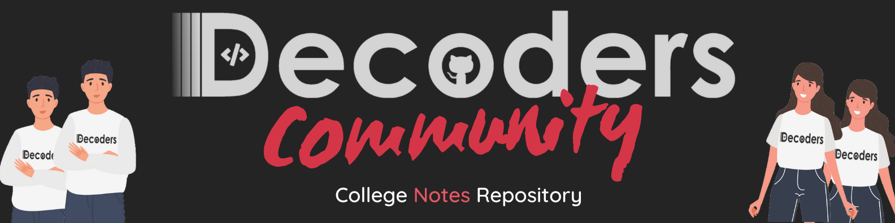

<a href="https://youtu.be/dMnF6b77BXY"></img></a>

   
☷☷☷☷☷☷☷☷☷☷☷☷☷☷☷☷☷☷☷☷☷☷☷☷☷☷☷☷☷☷☷☷☷☷☷☷☷☷☷☷☷☷☷☷☷☷☷☷☷☷☷☷☷☷☷☷☷
    

  

&nbsp; &nbsp; &nbsp;
  &nbsp; &nbsp; &nbsp;
  &nbsp; &nbsp; &nbsp;
  &nbsp; &nbsp; &nbsp;
  
 

 

 Do star the Decoder's College Notes repository ✨✨✨

   
☷☷☷☷☷☷☷☷☷☷☷☷☷☷☷☷☷☷☷☷☷☷☷☷☷☷☷☷☷☷☷☷☷☷☷☷☷☷☷☷☷☷☷☷☷☷☷☷☷☷☷☷☷☷☷☷☷
      

<a href="https://youtu.be/dMnF6b77BXY"></img></a>

☷☷☷☷☷☷☷☷☷☷☷☷☷☷☷☷☷☷☷☷☷☷☷☷☷☷☷☷☷☷☷☷☷☷☷☷☷☷☷☷☷☷☷☷☷☷☷☷☷☷☷☷☷☷☷☷☷

    

**STEP-1:** Fork this Repository
==========================================================================

 

   
☷☷☷☷☷☷☷☷☷☷☷☷☷☷☷☷☷☷☷☷☷☷☷☷☷☷☷☷☷☷☷☷☷☷☷☷☷☷☷☷☷☷☷☷☷☷☷☷☷☷☷☷☷☷☷☷☷
    

**STEP-2:** Select the Destination Folder
==========================================================================
**For Uploading Notes of First Year**

Select the Year Folder --> Then select the subject folder of which you want to add the notes

If the folder doesn't exists, create one with name formated as : SubjectName

========================================================================== 
**For Uploading Notes of All Years Except First Year**

Select the Year Folder --> Select the Branch Folder --> Then select the subject folder of which you want to add the notes

If the folder doesn't exists, create one with name formated as : SubjectName

 
☷☷☷☷☷☷☷☷☷☷☷☷☷☷☷☷☷☷☷☷☷☷☷☷☷☷☷☷☷☷☷☷☷☷☷☷☷☷☷☷☷☷☷☷☷☷☷☷☷☷☷☷☷☷☷☷☷
   

**STEP-3:** Upload the .pdf file in the respective folder
==========================================================================

Name format of the File for first year: {SubjectName} - {TopicName or Unit name} - {YourName} .pdf

Name format of the File for all years except first year: {TopicName or Unit name} - {YourName} .pdf

<!--   -->

   
☷☷☷☷☷☷☷☷☷☷☷☷☷☷☷☷☷☷☷☷☷☷☷☷☷☷☷☷☷☷☷☷☷☷☷☷☷☷☷☷☷☷☷☷☷☷☷☷☷☷☷☷☷☷☷☷☷
 
  

**STEP-4:** Write your Name and Roll number in commit message and press commit changes.
==========================================================================

 
☷☷☷☷☷☷☷☷☷☷☷☷☷☷☷☷☷☷☷☷☷☷☷☷☷☷☷☷☷☷☷☷☷☷☷☷☷☷☷☷☷☷☷☷☷☷☷☷☷☷☷☷☷☷☷☷☷
  

**STEP-5:** Create your pull request to master branch & wait for review

  

☷☷☷☷☷☷☷☷☷☷☷☷☷☷☷☷☷☷☷☷☷☷☷☷☷☷☷☷☷☷☷☷☷☷☷☷☷☷☷☷☷☷☷☷☷☷☷☷☷☷☷☷☷☷☷☷☷
    

**Note:** Please don't add books pdf, We prefer hand written notes more than books pdf

  

☷☷☷☷☷☷☷☷☷☷☷☷☷☷☷☷☷☷☷☷☷☷☷☷☷☷☷☷☷☷☷☷☷☷☷☷☷☷☷☷☷☷☷☷☷☷☷☷☷☷☷☷☷☷☷☷☷
      

<h3 align="center">🎉 Thanks for contributing to decoders community 🎉</h3>

